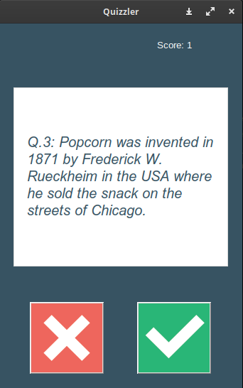

# Quizzler App

A simple quiz application built with Tkinter and powered by a Trivia Question API.

## Features

- Fetches trivia questions from a Trivia Question API.
- User-friendly Tkinter GUI for a smooth quiz experience.
- Keeps track of the user's score and displays it at top of quiz.
- Randomized questions for each quiz session.

## Technologies Used

- Python
- Tkinter (for GUI)
- Trivia Question API (provide API details here)

## Getting Started

### Prerequisites

- Python installed on your machine. You can download it [here](https://www.python.org/downloads/).

## Screenshot


### Installation

1. Clone the repository:

   ```bash
   git clone https://github.com/your-username/quizzler-app.git

## How to Run
  
  ```bash
  python main.py
